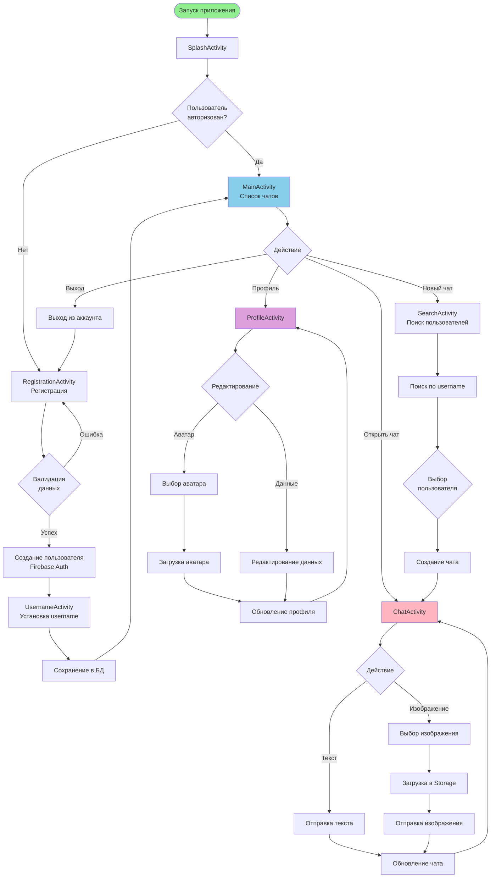
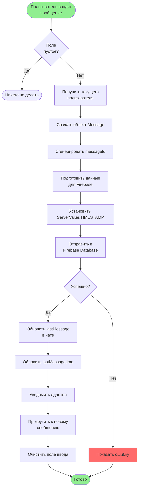
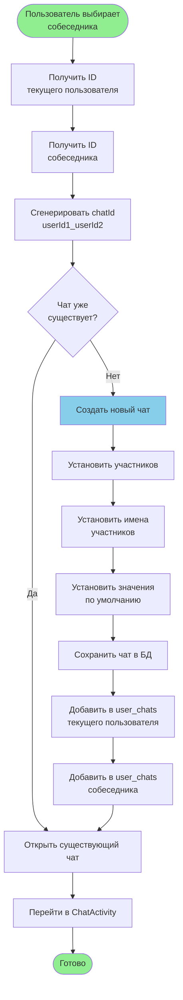
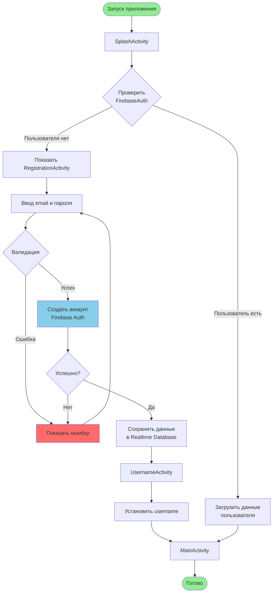
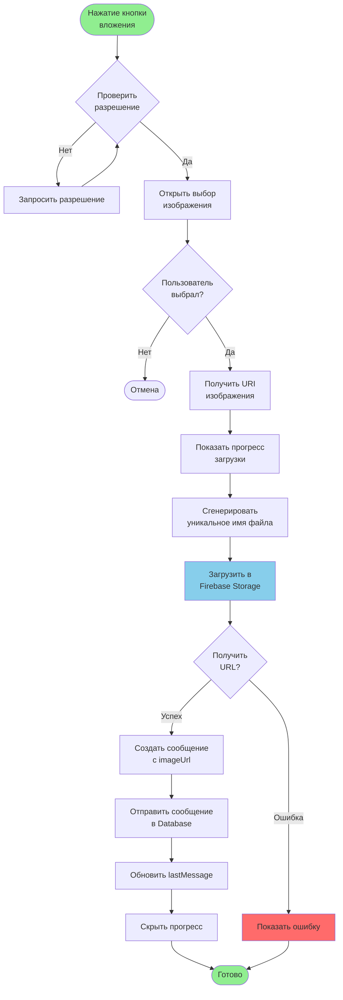

Блок-схема проекта Messager

Инструкция по использованию

Сайт для блок схемы
- **Mermaid Live Editor**: https://mermaid.live/

 Основной поток приложения (Mermaid)

## Детальная блок-схема процесса отправки сообщения

## Блок-схема процесса создания чата

## Блок-схема процесса аутентификации

## Блок-схема загрузки изображения

 Описание основных процессов

 1. Запуск приложения
- SplashActivity проверяет авторизацию
- Перенаправляет на MainActivity или RegistrationActivity

 2. Регистрация
- Валидация данных
- Создание аккаунта в Firebase Auth
- Сохранение данных пользователя
- Установка username

 3. Главный экран
- Загрузка списка чатов из Firebase
- Отображение с фильтрацией и поиском
- Обновление статуса онлайн/офлайн

 4. Создание чата
- Поиск пользователя
- Генерация уникального chatId
- Создание записи в базе данных
- Добавление в индексы user_chats

 5. Отправка сообщения
- Создание объекта Message
- Отправка в Firebase Database
- Обновление lastMessage в чате
- Обновление UI

 6. Загрузка изображения
- Проверка разрешений
- Выбор изображения
- Загрузка в Firebase Storage
- Получение URL
- Создание сообщения с imageUrl

