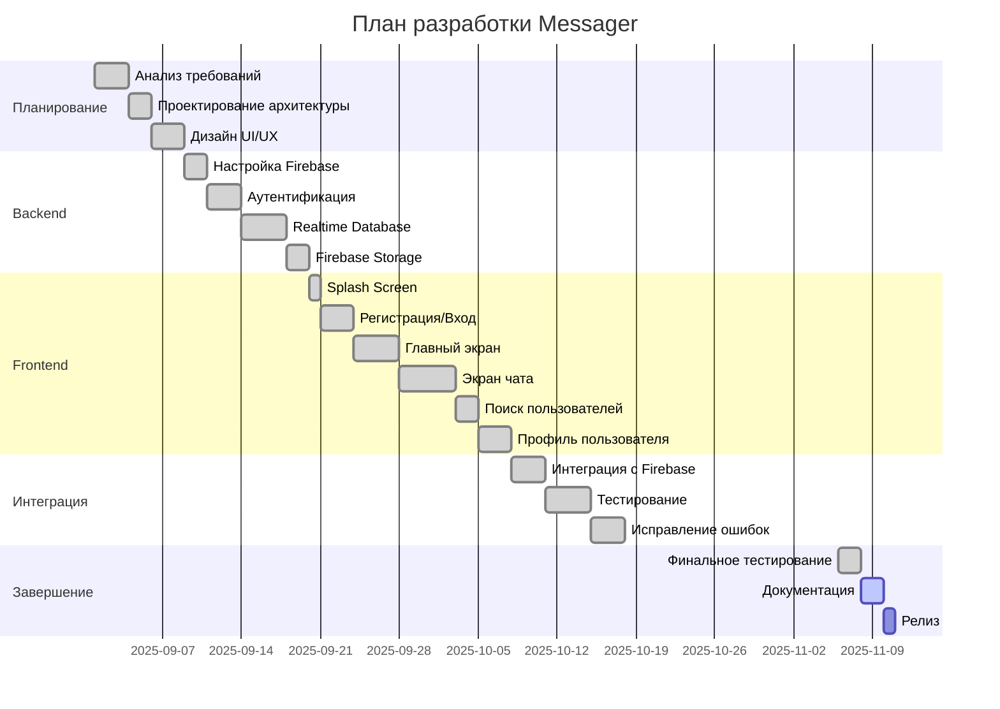

# Диаграмма Ганта - Проект Messager

## Инструкция по использованию

Скопируйте код ниже и вставьте на один из сайтов:
- **Mermaid Live Editor**: https://mermaid.live/
- **Draw.io**: https://app.diagrams.net/ (импорт через меню File > Import from > Device)

## Код для Mermaid Live Editor



## Альтернативный формат для Draw.io

Для использования в Draw.io создайте диаграмму Ганта вручную или используйте следующий XML-код:

```xml
<mxfile>
  <diagram>
    <mxGraphModel>
      <root>
        <mxCell id="0"/>
        <mxCell id="1" parent="0"/>
        <!-- Добавьте задачи вручную через интерфейс Draw.io -->
      </mxGraphModel>
    </root>
  </mxfile>
</mxfile>
```

## Описание этапов

### Планирование (5 дней)
- **Анализ требований**: Определение функциональных и нефункциональных требований
- **Проектирование архитектуры**: Проектирование структуры приложения и базы данных
- **Дизайн UI/UX**: Создание макетов интерфейса пользователя

### Backend (11 дней)
- **Настройка Firebase**: Настройка проекта Firebase, подключение сервисов
- **Аутентификация**: Реализация регистрации и входа через Firebase Auth
- **Realtime Database**: Настройка и интеграция Firebase Realtime Database для сообщений
- **Firebase Storage**: Настройка хранилища для изображений

### Frontend (18 дней)
- **Splash Screen**: Экран загрузки с проверкой авторизации
- **Регистрация/Вход**: Формы регистрации и входа
- **Главный экран**: Список чатов с поиском и фильтрацией
- **Экран чата**: Интерфейс обмена сообщениями и изображениями
- **Поиск пользователей**: Поиск и создание новых чатов
- **Профиль пользователя**: Просмотр и редактирование профиля

### Интеграция (10 дней)
- **Интеграция с Firebase**: Полная интеграция всех компонентов
- **Тестирование**: Модульное и интеграционное тестирование
- **Исправление ошибок**: Устранение найденных проблем

### Завершение (5 дней)
- **Финальное тестирование**: Полное тестирование приложения
- **Документация**: Написание пользовательской и технической документации
- **Релиз**: Подготовка и публикация приложения

## Общая длительность проекта

**Общее время разработки: ~49 дней**

---

*Примечание: Диаграмма отражает примерный план разработки. Реальные сроки могут отличаться в зависимости от сложности задач и ресурсов.*


