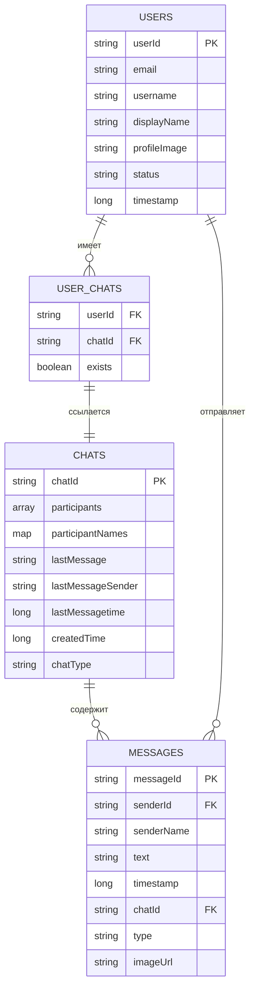

# Схема базы данных - Messager

## Описание

Приложение использует **Firebase Realtime Database** для хранения данных. База данных имеет иерархическую структуру в формате JSON.

## Инструкция по визуализации

Скопируйте код ниже и вставьте на один из сайтов:
- **Mermaid Live Editor**: https://mermaid.live/
- **dbdiagram.io**: https://dbdiagram.io/ (для ER-диаграмм)
- **Draw.io**: https://app.diagrams.net/

## Код для Mermaid Live Editor (ER-диаграмма)



## Структура базы данных (JSON)

```json
{
  "users": {
    "{userId}": {
      "userId": "string",
      "email": "string",
      "username": "string",
      "displayName": "string",
      "profileImage": "string (URL)",
      "status": "Online | Offline",
      "timestamp": "number (milliseconds)"
    }
  },
  "chats": {
    "{chatId}": {
      "chatId": "string (userId1_userId2)",
      "participants": ["userId1", "userId2"],
      "participantNames": {
        "userId1": "username1",
        "userId2": "username2"
      },
      "lastMessage": "string",
      "lastMessageSender": "string (userId)",
      "lastMessagetime": "number (milliseconds)",
      "createdTime": "number (milliseconds)",
      "chatType": "private",
      "messages": {
        "{messageId}": {
          "messageId": "string",
          "senderId": "string (userId)",
          "senderName": "string",
          "text": "string",
          "timestamp": "number (milliseconds)",
          "chatId": "string",
          "type": "text | image",
          "imageUrl": "string (URL) | null"
        }
      }
    }
  },
  "user_chats": {
    "{userId}": {
      "{chatId}": true
    }
  }
}
```

## Код для dbdiagram.io

```dbml
Table users {
  userId string [primary key]
  email string
  username string
  displayName string
  profileImage string
  status string
  timestamp long
}

Table chats {
  chatId string [primary key]
  participants string[]
  participantNames json
  lastMessage string
  lastMessageSender string
  lastMessagetime long
  createdTime long
  chatType string
}

Table messages {
  messageId string [primary key]
  senderId string
  senderName string
  text string
  timestamp long
  chatId string
  type string
  imageUrl string
}

Table user_chats {
  userId string
  chatId string
}

Ref: users.userId < user_chats.userId
Ref: chats.chatId < user_chats.chatId
Ref: chats.chatId < messages.chatId
Ref: users.userId < messages.senderId
```

Описание таблиц

 users
Хранит информацию о пользователях приложения.

**Поля:**
- `userId` (PK): Уникальный идентификатор пользователя (Firebase Auth UID)
- `email`: Email адрес пользователя
- `username`: Имя пользователя (никнейм)
- `displayName`: Отображаемое имя
- `profileImage`: URL фотографии профиля в Firebase Storage
- `status`: Текущий статус ("Online" или "Offline")
- `timestamp`: Время создания/обновления записи

 chats
Хранит информацию о чатах между пользователями.

**Поля:**
- `chatId` (PK): Уникальный идентификатор чата (формат: "userId1_userId2", отсортированные)
- `participants`: Массив ID участников чата
- `participantNames`: Map с именами участников (ключ: userId, значение: username)
- `lastMessage`: Текст последнего сообщения
- `lastMessageSender`: ID отправителя последнего сообщения
- `lastMessagetime`: Время последнего сообщения
- `createdTime`: Время создания чата
- `chatType`: Тип чата (всегда "private" для текущей версии)
- `messages`: Вложенная коллекция сообщений

 messages
Хранит сообщения в чатах (вложены в chats/{chatId}/messages).

**Поля:**
- `messageId` (PK): Уникальный идентификатор сообщения (генерируется через push())
- `senderId` (FK): ID отправителя (ссылка на users.userId)
- `senderName`: Имя отправителя (для быстрого доступа)
- `text`: Текст сообщения (может быть пустым для изображений)
- `timestamp`: Время отправки сообщения
- `chatId` (FK): ID чата (ссылка на chats.chatId)
- `type`: Тип сообщения ("text" или "image")
- `imageUrl`: URL изображения в Firebase Storage (если type = "image")

 user_chats
Индекс для быстрого поиска чатов пользователя.

**Структура:**
- `{userId}`: ID пользователя
  - `{chatId}`: ID чата (значение всегда `true`)

**Назначение:** Позволяет быстро получить список всех чатов конкретного пользователя без сканирования всей таблицы chats.

## Правила и ограничения

1. **chatId формируется** как `userId1_userId2`, где userId отсортированы лексикографически для обеспечения уникальности
2. **Сообщения хранятся** вложенными в структуру чата: `chats/{chatId}/messages/{messageId}`
3. **Статус пользователя** обновляется автоматически при onResume/onPause активности
4. **Изображения** хранятся в Firebase Storage, в БД сохраняется только URL
5. **Timestamp** использует ServerValue.TIMESTAMP для синхронизации времени на сервере

## Индексы и оптимизация

- `user_chats/{userId}` - индекс для быстрого поиска чатов пользователя
- `chats/{chatId}/messages` - упорядочены по `timestamp` для быстрой загрузки
- `users` - поиск по `username` для функции поиска пользователей

## Firebase Storage структура

```
firebase-storage/
├── profile_images/
│   └── profile_{userId}_{uuid}.jpg
└── chat_images/
    └── {chatId}/
        └── image_{timestamp}.jpg
```


